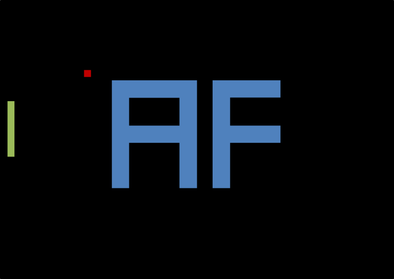
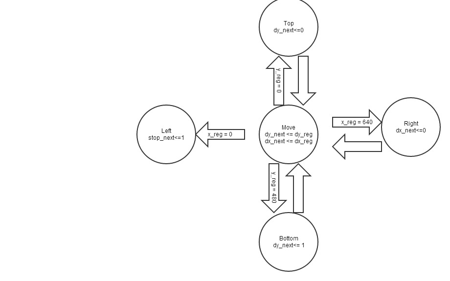

Lab2- Pong
=========

C2C John Miller

VHDL Code to play the classic game of pong on the Atlys Board

The game takes on the following form



This code also supports the use of the switches on the Atlys board for modifying the speed of the ball.

The major problems that this project dealt with were:
* Utilizing the already made vga modules and creating a dynamic image as opposed to a static one
* Implementing multiple state machines within the same module
* Finding a hardware based solution to debouncing, as opposed to a software based on that would be available in a programming language.
* Being able to use a clock that updates in a matter of nanoseconds to create a game that is playable by humans.


Version
----

1.2 -Implements the addition of "hot zones" on the paddle, which reflect the ball at different angles

Previous Versions
----
* 1.1 - Added support for manipulating ball speed via switches on the atlys board
* 1.0 - Basic pong functionality

Implementation
-----------
This project relied heavily on the use of a finite state machine [FSM], which uses a mix of next state logic, memory, and output logic in order to determine the state of the machine. The inputs and current state are fed into the next state logic block which then determines what the state will be. The current state is then fed into the output logic, which then generates the output.

The following basic constructs were used to realize the state machine:

Flip-flop (memory element):

```Vhdl
process(clk, reset)
begin
    	if (reset = '1') then
			x_reg <= to_unsigned(400,11);
			y_reg <= to_unsigned(200,11);
		elsif rising_edge(clk) then
			x_reg <= x_next;
			y_reg <= y_next;
		end if;

end process;

```

Next State logic:

```Vhdl
process(ball_reg, ball_next, count_next, x_reg, y_reg, paddle_y_reg)
begin

    ball_next <= ball_reg;
	
	if(count_next = 0) then
		case ball_reg is
			when move =>
				if (x_reg = 639) then
					ball_next <= right;
				elsif (x_reg = 10) then
					ball_next <= left;
				elsif (y_reg = 5) then 
					ball_next <= top;
				elsif (y_reg = 479) then
					ball_next <= bottom;
				end if;
				
				if (x_reg >10 and x_reg < 20) then 
					if ( (y_reg > paddle_y_reg - 45) and (y_reg< paddle_y_reg) ) then
						ball_next <= paddle_hit_hi;
					elsif( (y_reg < paddle_y_reg + 45) and (y_reg> paddle_y_reg) ) then
						ball_next <= paddle_hit_lo;
					end if;
				end if;
			when 	right =>
				ball_next <= move;
			when left => 
				ball_next <= move;
			when top =>
				ball_next <= move;
			when bottom =>
				ball_next <= move;
			when paddle_hit_hi =>
				ball_next <= move;
			when paddle_hit_lo =>
				ball_next <= move;
		end case;
	end if;
end process;

```
Output Buffer

```VHDL
process( count_next)
begin
    x_next<= x_reg;
	y_next <= y_reg;

 if(count_next = 0 and v_completed = '1' and stop_reg ='0') then
		if(dx_reg = '1') then
			x_next <= x_reg +1;
		else 
			x_next <= x_reg -1;
		end if;
		
		if(dy_reg = '1') then
			y_next <= y_reg -1;
		else 
			y_next <= y_reg +1;
		end if;
end if;	
end process;
```
Output logic

```VHDL
ball_x <= x_next;
ball_y <= y_next;

```


The following modules were to implement the game
* h_sync_gen.vhd - Synchronizes the horizontal aspect of the signal
* v_sync_gen.vhd - Synchronizes the vertical aspect of the signal
* vga_sync.vhd - Synchronizes the h_sync and v_sync signals to specify a specific pixel 
* button_module.vhd - Debounces the button inputs to make sure that each button press is only accounted for once.
* pong_control.vhd - Updates the game state based on ball position, paddle position, as well as external inputs to the board.
* pixel_gen.vhd - Displays the game based on the outputs of the pong_control module
* atlys_lab_video.vhd - Top-shell module
* dvid.vhd - Outputs the HDMI signal (converted by hardware to vga)

The modules are connected as shown below:


State transition diagram

Ball states :

 


Troubleshooting
--------------

The biggest troubles I had can be separated by module:

pixel_gen.vhd:
* Figuring out how to make the AF was a very tedious process that involved measuring out dimensions in paint. 
* Getting the ball to pass under the AF picture seemed daunting, then I realized that all I need to do is have the AF get drawn last

pong_control.vhd:
* The paddle kept going crazy when I tried to move it, turns out I had an inferred latch. Turns out those are actual things.
* The ball was moving at hyper speed, so I implemented a counter to slow it down. 
* The ball teleported every few seconds, this was alleviated by making the update conditional to v_completed.

Confirming functionality
--------------

Although they would have been a more robust method of testing, testbenches were not used in debugging the code, instead, it was done in incremental stages.

1. the AF logo was created, which was changed by modifying the pixel_gen module slightly each time until the output matched the design requirements

2. The paddle and ball were drawn to make sure that their proportions were correct

3. The paddle was tested until it met movement requirements. This meant changing lines of code at a time until the paddle moved at a reliable rate
    1. Within the creation of this module, the button debounce was implemented, which was tested by confirming paddle functionality.

4. The ball was incrementally tested, first for horizontal movement, then for vertical movement. Then the ball was tested to make sure it would bounce off the walls, and then that it would bounce off of the paddle and that it would freeze if it hit the left hand wall.

5. Once the core gameplay was created, the code was modified to support ball speeds and "hot zones" on the paddle. 
    
The hardest thing to test was the ball movement. The ball would work for periods of time and then it would "teleport", instantly moving to a different section of the screen.

Lessons Learned
---

* Think through state machines before implementing them
* Don't get attached to code, dumping bad code saved me a lot of time
* Sleep on problems, a good night's sleep is more valuable than 4 hours of spinning my wheels.
* Always check for inferred latches.


##### TODO

* make it modular
* convert code to use generics


Documentation
----

C2C Ryan Good helped me with debouncing

